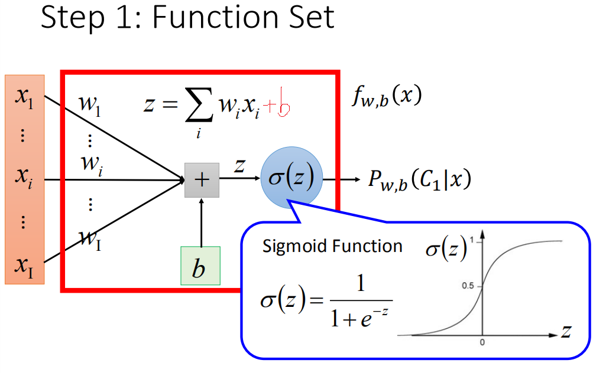
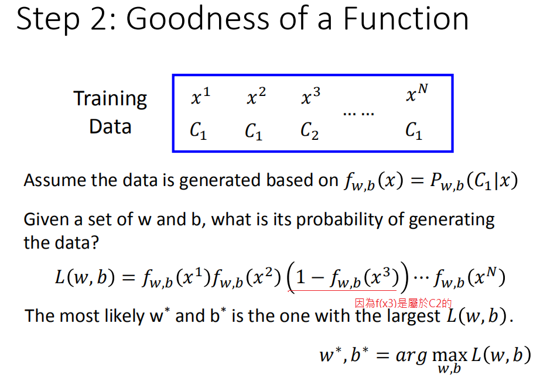
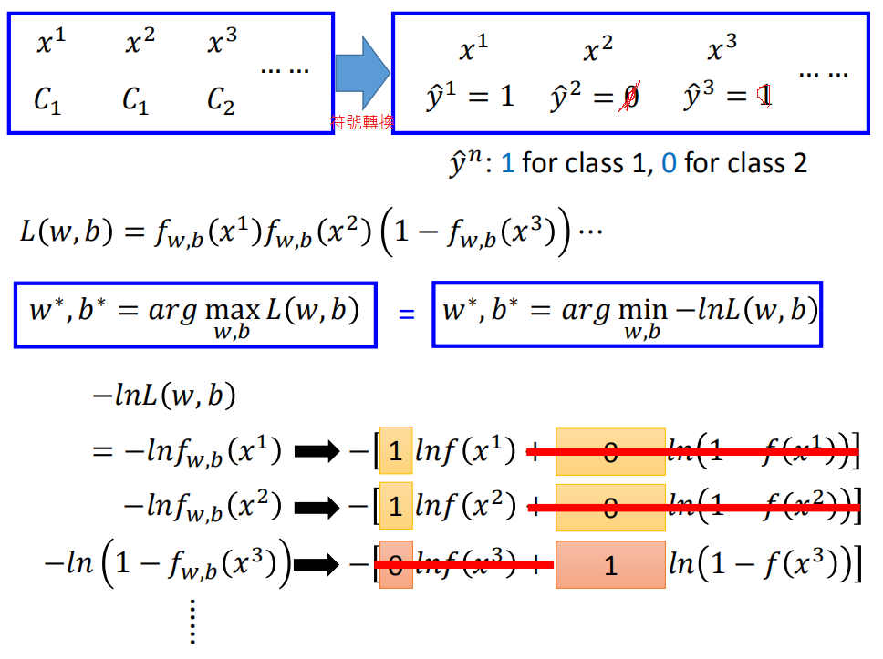
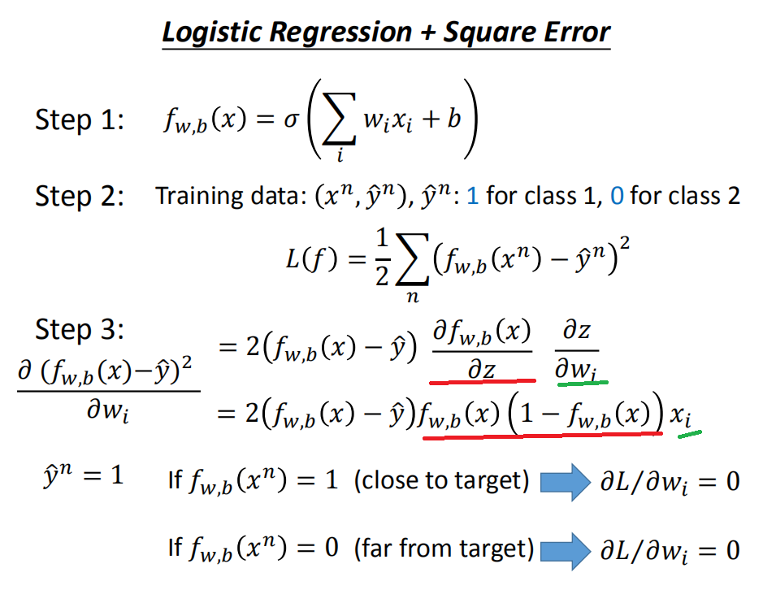

## logistic回歸
### Step1 邏輯回歸的函數集
上一篇講到分類問題的解決方法，推導出函數集的形式為：

將函數集可視化：

這種函數集的分類問題叫做 Logistic Regression（邏輯回歸），將它和第二篇講到的線性回歸簡單對比一下函數集：

### Step2 定義損失函數

上圖有一個訓練集，每個對象分別對應屬於哪個類型（例如 $x^3$ 屬於 $C_2$ ）。假設這些數據都是由後驗概率 $f_w,_b(x)=P_w,_b(C_1|x)$產生的。

給定一組 w和b，就可以計算這組w，b下產生上圖N個訓練數據的概率，

$L(w, b) = f_{w,b}(x^{1})f_{w,b}(x^{2}) \left( 1-f_{w,b}(x^{3}) \right) \cdots f_{w,b}(x^{N}) \qquad (1-1)$

對於使得 L(w,b)最大的w和 b，記做$w^∗​$ 和$b^∗​$ ，即：

$w^∗,b^∗=arg max_w,_bL(w,b)$

將訓練集數字化，並且將式1-2中求max通過取負自然對數轉化為求min ：

然後將 $−lnL(w,b)$ 改寫為下圖中帶藍色下劃線式子的樣子：

圖中藍色下劃線實際上代表的是兩個伯努利分布（0-1分布，兩點分布）的 cross entropy（交叉熵）

假設有兩個分布 
p 和 q，如圖中藍色方框所示，這兩個分布之間交叉熵的計算方式就是 H(p,q)H(p,q)；交叉熵代表的含義是這兩個分布有多接近，如果兩個分布是一模一樣的話，那計算出的交叉熵就是0

交叉熵的詳細理論可以參考《Information Theory（信息論）》，具體哪本書我就不推薦了，由於學這門科目的時候用的是我們學校出版的教材。。。沒有其他橫向對比，不過這裡用到的不複雜，一般教材都會講到。

下面再拿邏輯回歸和線性回歸作比較，這次比較損失函數：

此時直觀上的理解：如果把function的輸出和target（算出的function和真實的 $\hat{y}^n$）都看作是兩個伯努利分布，所做的事情就是希望這兩個分布越接近越好。

### Step3 尋找最好的函數
下面用梯度下降法求：

要求$−lnL(w,b)​$對 ​$w_i​$的偏微分，只需要先算出​$lnf_w,_b(x_n)​$ 對 $w_i​$的偏微分以及 ​$ln(1−f_w,_b(x_n))​$) 對 $w_i​$的偏微分。計算​$lnf_w,_b(x_n)​$ 對$w_i​$偏微分，$f_w,_b(x)​$可以用$\sigma{(z)}​$表示，而z可以用​$w_i​$和 b表示，所以利用鏈式法則展開。

計算 $ln(1−fw,b(x_n))​$ 對 $w_i​$   的偏微分，同理求得結果。

將求得兩個子項的偏微分帶入，化簡得到結果。

現在 $w_i​$ 的更新取決於學習率 η ，$x^n_i​$ 以及上圖的紫色劃線部分；紫色下劃線部分直觀上看就是真正的目標 $y^n ​$與我們的function差距有多大。

下面再拿邏輯回歸和線性回歸作比較，這次比較如果挑選最好的function：

logistic regression 跟 linear regression 的update(step 3)函數都一模一樣

對於邏輯回歸，target $y^n​$ 是0或者1，輸出是介於0和1之間。而線性回歸的target可以是任何實數，輸出也可以是任何值。

## 損失函數：為什麼不學線性回歸用平方誤差？

考慮上圖中的平方誤差形式。在step3計算出了對 $w_i$ 的偏微分。假設 $y^n=1$ ，如果 $f_w,_b(x_n)=1$，就是非常接近target，會導致偏微分中第一部分為0，從而偏微分為0；而 $f_w,_b(x_n)=0$，會導致第二部分為0，從而偏微分也是0。

對於兩個參數的變化，對總的損失函數作圖：

如果是交叉熵，距離target越遠，微分值就越大，就可以做到距離target越遠，更新參數越快。而平方誤差在距離target很遠的時候，微分值非常小，會造成移動的速度非常慢，這就是很差的效果了。

## 判別模型v.s. 生成模型

邏輯回歸的方法稱為Discriminative（判別） 方法；上一篇中用高斯來描述後驗概率，稱為 Generative（生成） 方法。它們的函數集都是一樣的：

如果是邏輯回歸，就可以直接用梯度下降法找出w和b；如果是概率生成模型，像上篇那樣求出 $μ^1,μ^2$ ，協方差矩陣的逆，然後就能算出w和b。

用邏輯回歸和概率生成模型找出來的w和b是不一樣的(因為邏輯回歸沒有假設，生成模型有假設，比如假設他是白努力)。

上圖是前一篇的例子，圖中畫的是隻考慮兩個因素，如果考慮所有因素，結果是邏輯回歸的效果好一些，為甚麼呢，且待以下分解。

### 一個好玩的例子

上圖的訓練集有13組數據，類別1里面兩個特徵都是1，剩下的(1, 0), (0, 1), (0, 0) 都認為是類別2；然後給一個測試數據(1, 1)，它是哪個類別呢？人類來判斷的話，不出意外基本都認為是類別1。下面看一下樸素貝葉斯分類器（Naive Bayes）會有什麼樣的結果。

樸素貝葉斯分類器如圖中公式：x屬於$C_i​$的概率等於每個特徵屬於$C_i​$概率的乘積。

計算出$P(C_1|x)​$的結果是小於0.5的，即對於樸素貝葉斯分類器來說，測試數據 (1, 1)是屬於類別2的，這和直觀上的判斷是相反的。其實這是合理，實際上訓練集的數據量太小，但是對於 (1, 1)可能屬於類別2這件事情，樸素貝葉斯分類器是有假設這種情況存在的（機器腦補這種可能性==）。所以結果和人類直觀判斷的結果不太一樣。

### 判別方法不一定比生成方法好

生成方法的優勢：

訓練集數據量很小的情況；因為判別方法沒有做任何假設，就是看著訓練集來計算，訓練集數量越來越大的時候，error會越小。而生成方法會自己腦補，受到數據量的影響比較小。
對於噪聲數據有更好的魯棒性（robust）。
先驗和類相關的概率可以從不同的來源估計。比如語音識別，可能直觀會認為現在的語音識別大都使用神經網絡來進行處理，是判別方法，但事實上整個語音識別是 Generative 的方法，DNN只是其中的一塊而已；因為還是需要算一個先驗概率，就是某句話被說出來的概率，而估計某句話被說出來的概率不需要聲音數據，只需要爬很多的句子，就能計算某句話出現的幾率。

## 多類別分類
### Softmax

下面看一下多類別分類問題的做法，具體原理可以參考《Pattern Recognition and Machine Learning》Christopher M. Bishop 著 ，P209-210

假設有3個類別，每個都有自己的weight和bias

把$z_1,z_2,z_3$
放到一個叫做Softmax的方程中，Softmax做的事情就是它們進行exponential（指數化），將exponential 的結果相加，再分別用 exponential 的結果除以相加的結果。原本$z_1,z_2,z_3$可以是任何值，但做完Softmax之後輸出會被限制住，都介於0到1之間，並且和是1。Softmax做事情就是對最大值進行強化。

輸入x，屬於類別1的幾率是0.88，屬於類別2的幾率是0.12，屬於類別3的幾率是0。

Softmax的輸出就是用來估計後驗概率（Posterior Probability）。為什麼會這樣？下面進行簡單的說明：

### 為什麼Softmax的輸出可以用來估計後驗概率？
假設有3個類別，這3個類別都是高斯分布，它們也共用同一個協方差矩陣，進行類似上一篇講述的推導，就可以得到Softmax。

信息論學科中有一個 Maximum Entropy（最大熵）的概念，也可以推導出Softmax。簡單說信息論中定義了一個最大熵。指數簇分布的最大熵等價於其指數形式的最大似然界。二項式的最大熵解等價於二項式指數形式(sigmoid)的最大似然，多項式分布的最大熵等價於多項式分布指數形式(softmax)的最大似然，因此為什麼用sigmoid函數，那是因為指數簇分布最大熵的特性的必然性。假設分布求解最大熵，引入拉格朗日函數，求偏導數等於0，直接求出就是sigmoid函數形式。還有很多指數簇分布都有對應的最大似然界。而且，單個指數簇分布往往表達能力有限，就引入了多個指數簇分布的混合模型，比如高斯混合，引出了EM算法。想LDA就是多項式分布的混合模型。

### 定義target

上一篇講到如果定義類別1是 $y_1$,$\hat{y_1}$, 類別2是 $y_2$, $\hat{y_2}$，類別3是 $y_3$, $\hat{y_3}$，這樣會人為造成類別1 和類型2有一定的關係這種問題(例如類別1和類別2比較近，類別1和類別3比較遠)。但可以將 $\hat{y}$定義為矩陣，這樣就避免了。而且為了計算交叉熵，$\hat{y}$也需要是個概率分布才可以。

## 邏輯回歸的限制

考慮上圖的例子，兩個類別分布在兩個對角線兩端，用邏輯回歸可以處理嗎？

這裡的邏輯回歸所能做的分界線就是一條直線，沒有辦法將紅藍色用一條直線分開。

### 特徵轉換

特徵轉換的方式很多，舉例類別1轉化為某個點到 (0,0)(0,0) 點的距離，類別2轉化為某個點到 (1,1)(1,1) 點的距離。然後問題就轉化右圖，此時就可以處理了。但是實際中並不是總能輕易的找到好的特徵轉換的方法。

### 級聯邏輯回歸模型

可以將很多的邏輯回歸接到一起，就可以進行特徵轉換。比如上圖就用兩個邏輯回歸 對$z_1,z_2$來進行特徵轉換，然後對於 $x_1^{'},x_2^{'}$，再用一個邏輯回歸zz來進行分類。

對上述例子用這種方式處理：

右上角的圖，可以調整參數使得得出這四種情況。同理右下角也是

經過這樣的轉換之後，點就被處理為可以進行分類的結果。

一個邏輯回歸的輸入可以來源於其他邏輯回歸的輸出，這個邏輯回歸的輸出也可以是其他邏輯回歸的輸入。把每個邏輯回歸稱為一個 Neuron（神經元），把這些神經元連接起來的網絡，就叫做 Neural Network（神經網絡）。

