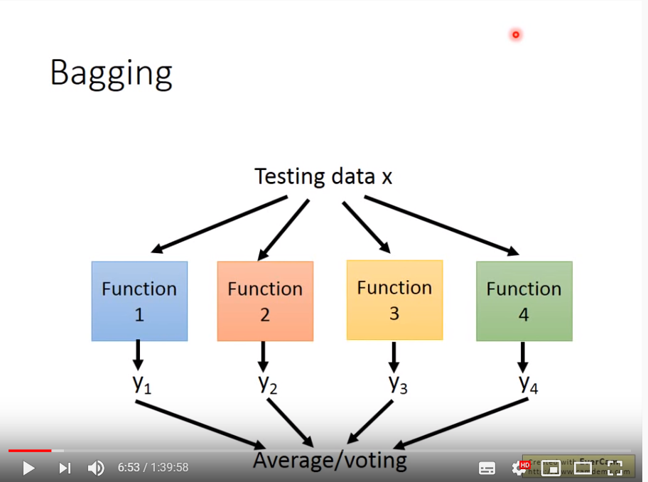
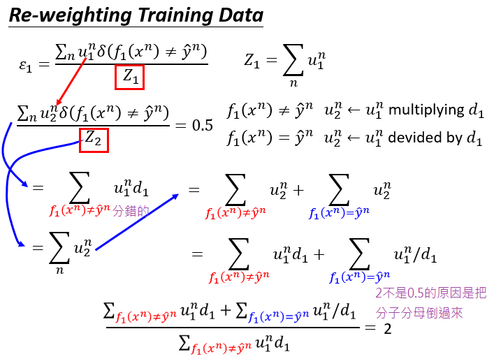
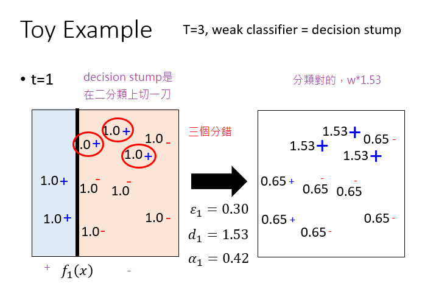
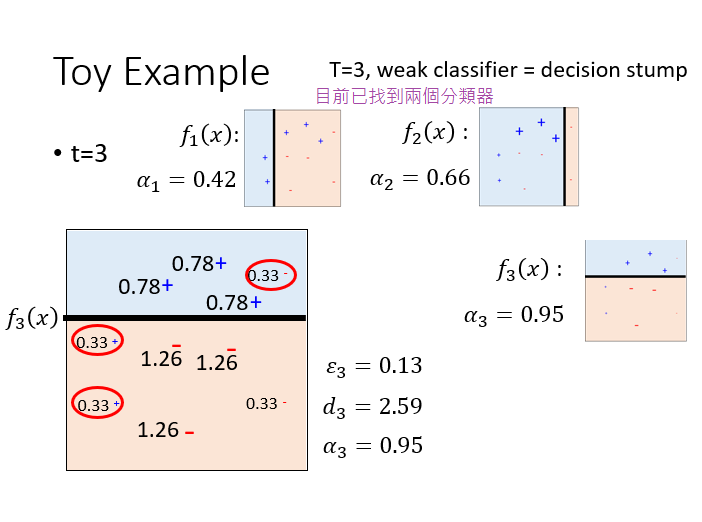
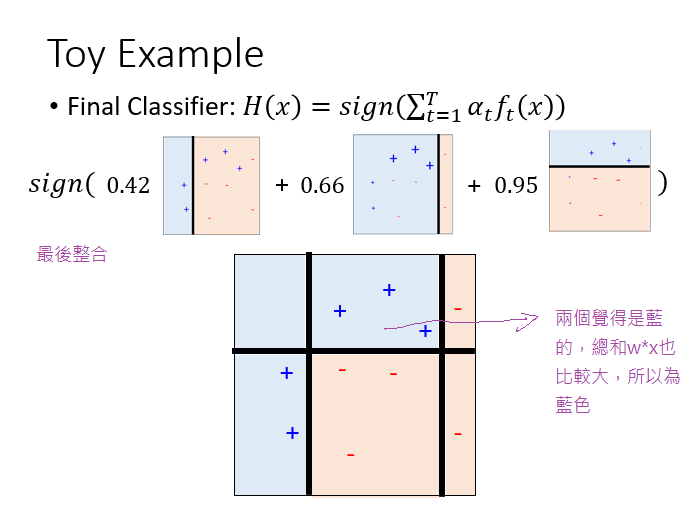
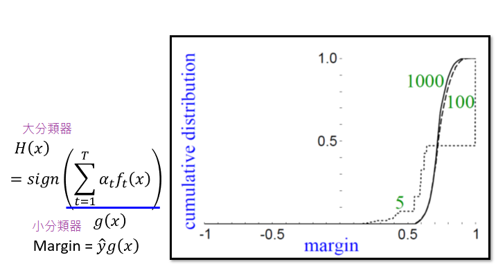

## Ensemble的框架

Ensemble的方法就是一種團隊合作，好幾個模型一起上的方法。

- 第一步：通常情況是有很多的classifier，想把他們集合在一起發揮更強大的功能，這些classifier一般是diverse的，這些classifier有不同的屬性和不同的作用。舉個例子，就像大家一起出團去打王的時候，每個人都有自己需要做的工作，比如有人扮演坦，有人扮演補，有人扮演DD（輸出）。
- 第二步：就是要把classifier用比較好的方法集合在一起，就好像打王的時候坦和DD都站不同的位置，通常用ensemble可以讓我們的表現提升一個檔次，一般在kaggle之類的比賽中，ensemble用的最多的也是效果最好的，一般前幾名都需要用ensemble。

## Ensemble : Bagging

我們先來回顧一下bias和variance，對於簡單的模型，我們會有比較大的bias但是有比較小的variance，如果是複雜的模型，我們則是比較小的bias但是有比較大的variance。從上圖上看，在這兩者的組合下，我們最後的誤差（藍色的線）會隨著模型數目的增加，先下降後逐漸上升。

在之前的寶可夢例子中，根據不同的事件我們會得到一個模型，如果一個複雜的模型就會有很大的variance。這些模型的variance雖然很大，但是bias是比較小的，所以我們可以把不同的模型都集合起來，把輸出做一個平均，得到一個新的模型$\hat{f}​$，這個結果可能和正確的答案就是接近的。Bagging就是要體現這個思想。
Bagging就是我們自己創造出不同的dataset，再用不同的dataset去訓練一個複雜的模型，每個模型獨自拿出來雖然方差很大，但是把不同的方差大的模型集合起來，整個的方差就不會那麼大，而且偏差也會很小。

上圖表示了用自己采樣的數據進行Bagging的過程。在原來的N筆訓練數據中進行采樣，過程就是每次從N筆訓練數據中取N‘（通常N=N’）建立很多個dataset，這個過程抽取到的可能會有重複的數據，但是每次抽取的是隨機形成的dataset。每個dataset都有N'筆data，但是每個dataset的數據都是不一樣的，接下來就是用一個複雜的模型對四個dataset都進行學習得到四個function，接下來在testing的時候，就把這testing data放到這四個function裡面，再把得出來的結果做平均（回歸）或者投票（分類），通常來說表現（variance比較小）都比之前的好，這樣就不容易產生過擬合。
做Bagging的情況：模型比較複雜，容易產生過擬合。（容易產生過擬合的模型：決策樹）目的：降低方差

## 決策樹

隨機森林（Random Forest）就是決策樹（Decision tree）做Bagging的版本。假設給定的每個Object有兩個feature，我們就用這個training data建立一顆樹，如果$x_{1}$小於0.5就是yes（往左邊走），當$x_{1}$大於0.5就是no（往右邊走），接下來看$x_{2}$，當$x_{2}$小於0.3時就是class1（對應坐標軸圖中左下角的藍色）當大於0.3時候就是class2（紅色）；對右邊的當$x_{2}$小於0.7時就是紅色，當$x_{2}$大於0.7就是藍色。這是一個比較簡單的例子，其實可以同時多個dimension，可以變得更複雜。
做決策樹時會有幾個地方需要注意：比如每個節點分支的數量，用什麼樣的標準來進行分支，什麼時候停止分支，基本的假設等等問題。

### 決策樹的實際例子：初音問題

描述：輸入的特徵是二維的，紅色的部分是class1，藍色的部分是class2，其中class1分布的和初音的樣子是一樣的。我們用決策樹對這個問題進行分類。

### 實驗結果

上圖可以看到，深度是5的時候效果並不好，圖中白色的就是class1，黑色的是class2.當深度是10的時候有一點初音的樣子，當深度是15的時候，基本初音的輪廓就出來了，但是一些細節還是很奇怪（比如一些凸起來的邊角）當深度是20的時候，就可以完美的把class1和class2的位置區別開來，就可以完美地把初音的樣子勾勒出來了。對於決策樹，理想的狀況下可以達到錯誤是0的時候，最極端的就是每一筆data point就是很深的樹的一個節點，這樣正確率就可以達到100%（樹夠深，決策樹可以做出任何的function）但是決策樹很容易過擬合，如果只用決策樹一般很難達到好的結果。

用決策樹做Bagging就是隨機森林
傳統的隨機森林是通過之前的重采樣的方法做，但是得到的結果是每棵樹都差不多（效果並不好）。比較多的是隨機的限制一些特徵或者問題不能用，這樣就能保證就算用同樣的dataset，每次產生的決策樹也會是不一樣的，最後把所有的決策樹的結果都集合起來，就會得到隨機森林。
如果是用Bagging的方法的話，用out-of-bag可以做驗證。用這個方法可以不用把label data劃分成training set和validation set，一樣能得到同樣的效果。
具體做法：假設我們有training data是$x^{1}​$,$x^{2}​$,$x^{3}​$,$x^{4}​$,$f_{1}​$我們只用第一筆和第二筆data訓練（圓圈表示訓練，叉表示沒訓練），$f_{2}​$我們只用第三筆第四筆data訓練，$f_{3}​$用第一，第三筆data訓練，$f_{4}​$表示用第二，第四筆data訓練，我們知道，在訓練$f_{1}​$和$f_{4}​$的時候沒用用到$x^{1}​$，所以我們就可以用$f_{1}​$和$f_{4}​$Bagging的結果在$x^{1}​$上面測試他們的表現，同理，我們可以用$f_{2}​$和$f_{3}​$Bagging的結果來測試$x^{2}​$，下面幾個也是同樣的道理。
最後用把每個測試的結果取平均的error，就作為最後的error。雖然我們沒有明確的切出一個驗證集，但是我們做測試的時候所有的模型並沒有看過那些測試的數據。所有這個輸出的error也是可以作為反映測試集結果的估測效果。
接下來是用隨機森林做的實驗結果：

強調一點是做Bagging更不會使模型能fit data，所有用深度為5的時候還是不能fit出一個function，所有就是5顆樹的一個平均，相當於得到一個比較平滑的樹。當深度是10的時候，大致的形狀能看出來了，當15的時候效果就還不錯，但是細節沒那麼好，當20 的時候就可以完美的把初音分出來。

## Boosting

Boosting是用在很弱的模型上的，當我們有很弱的模型的時候，不能fit我們的data的時候，我們就可以用Boosting的方法。
Boosting有一個很強的保證：如果你的機器學習算法能產生錯誤率小於50%的分類器，這個方法可以保證錯誤率達到0%。
Boosting的結構：

- 首先要找一個分類器$f_1{(x)}$
- 接下再找一個輔助$f_1{(x)}$的分類器$f_2{(x)}$（注意$f_2{(x)}$如果和$f_1{(x)}$很像，那麼$f_2{(x)}$的幫助效果就不好，所以要盡量找互補的$f_2{(x)}$，能夠彌補$f_1{(x)}$沒辦法做到的事情）
- 得到第二個分類器$f_2{(x)}$
- 最後就結合所有的分類器得到結果
注意：Boosting的訓練是有順序的（sequentially），Bagging是沒有順序的（可以同時train）

### 如何得到不同的分類器？
- 製造不同的訓練數據來得到不同的分類器
—— 用重采樣的方法來訓練數據得到新的數據集
—— 用重新賦權重的的方法來訓練數據得到新的數據集，上圖中用u來代表每一筆data的權重，可以通過改變weight來製造不同的data，舉例來說就是剛開始都是1，第二次就分別改成0.4,2.1,0.7，這樣就製造出新的data set。但是在實際中，就算改變權重，對訓練沒有太大影響。在訓練時，原來的loss function是$L(w)=\sum\limits_{n}l(f(x^n),\hat{y}^n)​$其中$l​$可以是任何不同的function，只要能衡量$f(x^n)​$和$\hat{y}^n​$之間的差距就行，然後用gradient descent 的方法來最小化這個L（total loss function）當加上權重後，變成了$L(w)=\sum\limits_{n}u_nl(f(x^n),\hat{y}^n)​$,相當於就是在原來的基礎上乘以$u​$。這樣從loss function來看，如果有一筆data的權重比較重，那麼在訓練的時候就會被多考慮一點。

## Adaboost

#### 想法：先訓練好一個分類器$f_1(x)$，要找一組新的training data，讓$f_1(x)$在這組data上的表現很差，然後讓$f_2(x)$在這組training data上訓練。
怎麼找一個新的訓練數據集讓$f_1(x)​$表現差？
上圖中的$\epsilon_1​$就是訓練數據的error rate，這個就是對所有訓練的樣本求和，$\delta(f_1(x^n)\neq\hat{y}^n)​$是計算每筆的training sample分類正確與否，用0來表示正確，用1來表示錯誤，然後乘以一個weight$u​$，然後做normalization，這個$Z_1​$標準化就是對所有的weight,這裡的$\epsilon_1<0.5​$
然後我們用$u_2​$的權重來進行計算得到error rate恰好等於0.5。這個過程相當於重新給訓練數據賦權重，原來用u1作為訓練數據的權重，現在用u2作為訓練數據的權重，在新的權重上，$f_1(x)​$的表現就是隨機的，接下來我們拿這組新的訓練數據集再去訓練$f_2(x)​$，這樣的$f_2(x)​$和$f_1(x)​$就是互補的。

### 實際的例子

假設我們上面的四組訓練數據，權重就是$u_1$到$u_4$，並且每個初始值都是1，我們現在用這四組訓練數據去訓練一個模型$f_1(x)$，假設$f_1(x)$只分類正確其中的三筆訓練數據，所以$\epsilon_1=0.25$
然後我們改變每個權重，把對的權重改小一點，把第二筆錯誤的權重改大一點（就比如當你做完考卷，老師說把你錯誤題目的分數增大，你就會很生氣，這裡對應的就是讓$f_1(x)$在新的訓練集上表現差）這樣一來，$f_1(x)$在新的訓練數據集上表現就會變差$\epsilon_1=0.5$。
然後在得到的新的訓練數據集上訓練得到$f_2(x)$，這個$f_2(x)$訓練完之後得到的$\epsilon_2$會比0.5小。

### Reweight的具體流程
假設訓練數據$x^n$會被$f_1(x)$分類錯，那麼就把第n筆data的$u^n_1$乘上$d_1$變成$d_2$，這個$d_1$是大於1的值（也就是把錯誤分類的data權重提高）
如果$x^n$正確的被$f_1(x)$分類的話，那麼就用$u^n_1$除以$d_1$變成$d_2$（也就是把正確分類的data的權重減少）
$f_2(x)$就會在新的權重$u^n_2$上進行訓練。
對於$d_1$

對於圖中分子部分分類錯誤的$f_1(x^n)\neq\hat{y}^n$對應的$u^n_1$就乘上$d_1$，再看分母的部分，$Z_2$就等於$\sum\limits_n{u^n_2}$，同時也等於後面分類錯誤和分類正確的兩個$u^n_1$的權重和。所以結合一下然後再取個倒數就可以得到圖中最後一個式子。

最後能得到結果是$d_1=\sqrt{(1-\epsilon_1)/\epsilon_1}$,然後用這個$d_1$去乘或者除權重，就能得到讓$f_2(x)$表現不好的新的訓練數據集。
注意：$d_1$是大於1的，因為$\epsilon_1$是小於0.5，所以該式子會大於1

### 總結AdaBoost

給定一筆訓練數據以及其權重，設置初始的權重為1，接下來用不同的權重來進行很多次迭代訓練弱分類器，然後再把這些弱的分類器集合起來就變成一個強的分類器。其中在每次迭代中，每一筆訓練數據都有其對應的權重。
用每個弱分類器對應的權重訓練出每個弱分類器$f_t(x)​$，計算$f_t(x)​$在各自對應權重中的錯誤率$\epsilon_t​$。
然後就可以重新給訓練數據賦權值，如果分類錯誤的數據，就用原來的$u^n_t​$乘上$d_t​$來更新其權重，反之就把原來的$u^n_t​$除以$d_t​$得到一組新的權重，然後就繼續在下一次迭代中繼續重複操作。（其中$d_1=\sqrt{(1-\epsilon_1)/\epsilon_1}​$）
或者對$d_t​$我們還可以用$\alpha_t=ln\sqrt{(1-\epsilon)/\epsilon}​$來代替，這樣我們就可以直接統一用乘的形式來更新$u^n_t​$，變成了乘以$exp(\alpha_t)​$或者乘以$exp(-\alpha_t)​$，這裡的正負1用$-\hat{y}^nf_t(x^n)​$來取正負號(當分類錯誤該式子就是正的，分類正確該式子就是負的)這樣表達式子就會更加簡便。

經過剛才的訓練之後我們就得到了$f_1(x)​$到$f_T(x)​$，
一般有兩種方法進行集合：
Uniform weight：我們把T個分類器加起來看其結果是正的還是負的（正的就代表class1，負的就代表class2），這樣可以但不是最好的，因為分類器中有好有壞，如果每個分類器的權重都一樣的，顯然是不合理的。
Non-uniform weight:在每個分類器前都乘上一個權重$\alpha_t​$,然後全部加起來後取結果的正負號，這種方法就能得到比較好的結果
這裡的$\alpha_t=ln\sqrt{(1-\epsilon)/\epsilon}​$從後面的例子可以看到，錯誤率比較低的$\epsilon_t​$=0.1得到最後的$\alpha_t​$=1.10就比較大，反之，如果錯誤率比較高的$\epsilon_t​$=0.4得到最後的$\alpha_t​$=0.20就比較小。
總結：錯誤率比較小的分類器，最後在最終結果的投票上會有比較大的權重。

## Toy example

Decision stump：假設所有的特徵都分布在二維平面上，在二維平面上選一個維度切一刀，其中一邊當做class1，另外一邊當做class2。
上圖中t=1時，我們先用decision stump找一個$f_1(x)$，左邊就是正類，右邊就是負類，其中會發現有三筆data是錯誤的，所以能得到錯誤率是0.3，$d_1$=1.53(訓練數據更新的權重),$\alpha_1$=0.42（在最終結果投票的權重）
然後改變每筆訓練數據的權重，分類錯誤的權重就要變大（乘以1.53），分類對的權重就變小(0.65)
t=2和t=3按照同樣的步驟,就可以得到第二和第三個分類器。由於設置了三次迭代，這樣訓練就結束了，用之前每個分類器乘以對應的權重，就可以得到最終分類器。
結果整合：這個三個分類器把平面分割成六個部分，左上角三個分類器都是藍色的，那就肯定就藍色的。上面中間部分第一個分類器是紅色的，第二個第三個是藍色的，但是後面兩個加起來的權重比第一個大，所以最終中間那塊是藍色的，對于右邊部分，第一個第二個分類器合起來的權重比第三個藍色的權重大，所以就是紅色的。下面部分也是按照同樣道理，分別得到藍色，紅色和紅色。所以這三個弱分類器其實本事都會犯錯，但是我們把這三個整合起來就能達到100%的正確率了。

## AdaBoost證明推導

上式中的$H(x)​$是最終分類結果的表達式，$\alpha_t​$是權重(與$\epsilon_t​$有關)，$\epsilon_t​$是錯誤率。

先計算總的訓練數據集的錯誤率，也就是$\frac{1}{N}\sum\limits_{n}\delta{H(x^n)\neq\hat{y^n}}​$其中$H(x^n)\neq\hat{y^n}​$得到的就是1，反之如果$H(x^n)=\hat{y^n}​$就是0
進一步，可以把$H(x^n)\neq\hat{y^n}​$寫成$\hat{y^n}g(x^n)<0​$,如果$\hat{y^n}g(x^n)​$是同號的代表是正確的，如果是異號就代表分類錯誤的。整個錯誤率有一個上界就是$\frac{1}{N}\sum\limits_{n}exp(-\hat{y}^ng(x^n))​$
上圖中橫軸是$\hat{y^n}g(x^n)​$，綠色的線代表的是$\delta​$的函數，藍色的是$exp(-\hat{y}^ng(x^n))​$也就是綠色函數的上限。

### 證明上界函數會越來越小

上式證明中，思路是先求出$Z_T+1​$(也就是第T+1次訓練數據集權重的和),就等於$\sum\limits_{n}u_{T+1}^n​$,而$u_{t+1}^n​$與$u_{t}^n​$有關係，通過聯立$u_{1}^n​$到$u_{t+1}^n​$的式子，能得到就是T次連乘的$exp(-\hat{y}^nf_t(x^n)\alpha_t)​$,也就是$u_{T+1}^n​$然後在累加起來得到$Z_T+1​$
同時把累乘符號放到exp裡面去變成了累加，由於$\hat{y}^n​$是迭代中第n筆的正確答案，所以和累乘符號沒有關係，就會發現後面的$\sum\limits_{t=1}f_t(x^n)\alpha_t​$恰好等於圖片最上面的$g(x)​$
這樣就說明了，訓練數據的權重的和會和訓練數據的錯誤率有關係。
接下來就是證明權重的和會越來越小就可以了。

$Z_1​$的權重就是每一筆初試權重的和N，然後這裡的$Z_{t}​$就是要根據$Z_{t-1}​$來求出；對於分類正確的，用$Z_{t-1}​$乘以$exp(\alpha_t)​$乘以$\epsilon_t​$,對於分類錯誤的就乘以$exp(-\alpha_t)​$再乘以$1-\epsilon_t​$。
然後再把$\alpha_t​$代入到這個式子中化簡得到得到$Z_{t-1}\times{2\sqrt{\epsilon_t(1-\epsilon_t)}}​$
其中，$\epsilon_t​$是錯誤率，肯定小於0.5，所以$2\sqrt{\epsilon_t(1-\epsilon_t)}​$最大值是當$\epsilon_t=0.5​$時，最大值為1，所以$Z_t​$小於等於$Z_{t-1}​$。
$Z_{T+1}​$就是N乘以T個$2\sqrt{\epsilon_t(1-\epsilon_t)}​$
最後我們知道，這樣的一來訓練數據的錯誤率就會越來越小

## AdaBoost的神秘現象

其中圖中x軸是訓練的次數，y軸是錯誤大小，從這張圖我們發現訓練數據集上的錯誤率其實很快就變成了0（大概在第五次左右就是0），但是測試數據集上錯誤一直在不斷下降。

#### 我們把$\hat{y}g(x)$定義為margin
原因：圖中是5，100,1000個權重的分類器結合在一起時的分布圖，當5個分類器結合的時候，其實margin已經大於0了，但是當增加弱分類器的數量的時候，margin還會一直變大，增加margin的好處就是增加這個方法魯棒性，也就是在測試集上能得到比較好的結果。
為什麼margin會增加？

該圖是$\hat{y}^ng(x^n)$的函數圖像，紅色的線就是AdaBoost的目標函數，從圖中可以看出AdaBoost的在$\hat{y}$為0時，依然能不斷的下降，也就是讓$\hat{y}^ng(x^n)​$(margin)能不斷增大，得到更小的錯誤。

### AdaBoost+決策樹做初音的例子

本來深度是5的決策樹是不能做好初音的分類（只能通過增加深度來進行改進），但是現在有了AdaBoost的決策樹是互補的，所以用AdaBoost就可以很好的進行分類。T代表AdaBoost運行次數，圖中可知用AdaBoost，100棵樹就可以很好的對初音進行分類。

## Gradient Boosting

Gradient Boosting是Boosting的更泛化的一個版本。
具體步驟：
- 初始化一個$g_{0}(x)=0$,
- 現在進行很多次的迭代，找到一組$f_t(x)$和$\alpha_t$來共同改進$g_{t-1}(x)$
- $g_{t-1}(x)$就是之前得到所有的$f(x)$和$\alpha$乘積的和
- 把找到的一組$f_t(x)$和$\alpha_t$（與$g_{t-1}(x)$互補）加上原來的$g_{t-1}(x)$得到新的$g_{t}(x)$，這樣$g_{t}(x)$就比原來的$g_{t-1}(x)$更好
- 最後再得到T個迭代的$H(x)$
這裡的cost function是$L(g)=\sum\limits_{n}l(\hat{y}^n,g(x^n))$,其中$l$是$\hat{y}^n$和$g(x^n)$的差異（loss function，這個函數可以直接選擇，可以是交叉熵，也可以是均方誤差）這裡定義成了$exp(-\hat{y}^ng(x^n))$
接下來我們要最小化損失函數，我們就需要用梯度下降來更新每個$g(x)$

從梯度下降角度考慮：上圖式子中，我們需要用函數$g(x)$對$L(g)$求梯度，然後用這個得到的梯度去更新$g_{t-1}$,得到新的$g_{t}$
這裡對$L(g)$求梯度的函數$g(x)$就是可以想成包含很多參數的，通過調整參數就能改變函數的形狀，這樣就可以對$L(g)$做偏微分
從Boosting角度考慮，紅色框的兩部分是同方向的，如果$f_t(x)$和微分的方向是一致的話，那麼就可以把$f_t(x)$加上$g_{t-1}(x)$，就可以讓新的損失減少。

我們希望$f_t(x)$和$\sum\limits_{n}exp(-\hat{y}^ng_t(x^n))(\hat{y}^n)$方向越一致越好。所以我們構造一個函數讓兩個式子相乘求其最大值，這樣就能保證這兩個式子方向很一致。對於得到的新式子，$exp(-\hat{y}^ng_t(x^n))$就是權重，經過計算之後發現這個權重恰好就是AdaBoost上的權重。

這裡找出來的$f_t(x)$，其實也就是AdaBoost找出來的$f_t(x)$,所以在AdaBoost的時候，找一個弱的分類器$f_t(x)$的時候，就相當於用梯度下降更新損失，值得損失會變小。
由於求$f_t(x)$是很不容易才找到的，所以我們這裡就會給$f_t(x)$配一個最好的$\alpha_t$，把$f_t(x)$的價值發揮到最大。
對於$\alpha_t$,$\alpha_t$就很像學習率，但是這裡有點不一樣，我們是固定$f_t(x)$，窮舉所有的$\alpha_t$，找到一個$\alpha_t$使得$g_{t}(x)$的損失更小
實際中就是求解一個最優化問題，找出一個$\alpha_t$，讓$L(g)$最小。
巧合的是找出來的$\alpha_t$就是$\alpha_t=ln\sqrt{(1-\epsilon_t)/\epsilon_t}​$
AdaBoost其實可以想成在做梯度下降，只是這個梯度是一個函數，然後有一個很好的方法來決定學習率的這樣一個問題。
Gradient Boosting有一個好的就是我們可以任意更改目標函數。這樣就可以創造出很多新的方法。

## Stacking

上圖中，把一筆數據x輸入到四個不同的模型中，然後每個模型輸出一個y，然後用投票法決定出最好的（對於分類問題）

但是有個問題就是並不是所有系統都是好的，有些系統會比較差，但是如果採用之前的設置低權重的方法又會傷害小毛的自尊心，這樣我們就提出一種新的方法：
把得到的y當做新的特徵輸入到一個最終的分類器中，然後再決定最終的結果。
對於這個最終的分類器，應當採用比較簡單的函數（比如說邏輯回歸），不需要再採用很複雜的函數，因為輸入的y已經訓練過了。
在做stacking的時候我們需要把訓練數據集再分成兩部分，一部分拿來學習最開始的那些模型，另外一部分的訓練數據集拿來學習最終的分類器。原因是有些前面的分類器只是單純去擬合training data，比如小明的代碼可能是亂寫的，他的分類器就是很差的，他做的只是單純輸出原來訓練數據集的標籤，但是根本沒有訓練。如果還用一模一樣的訓練數據去訓練最終分類器，這個分類器就會考慮小明系統的功能。所以我們必須要用另外一部分的數據來訓練最終的分類器，然後最終的分類器就會給之前的模型不同的權重。

